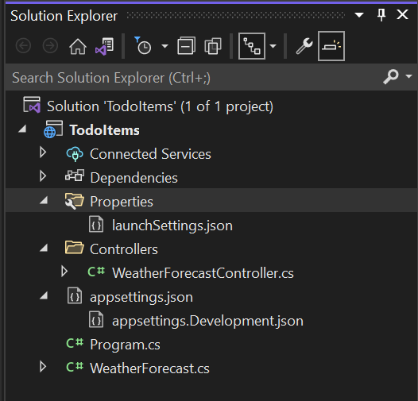
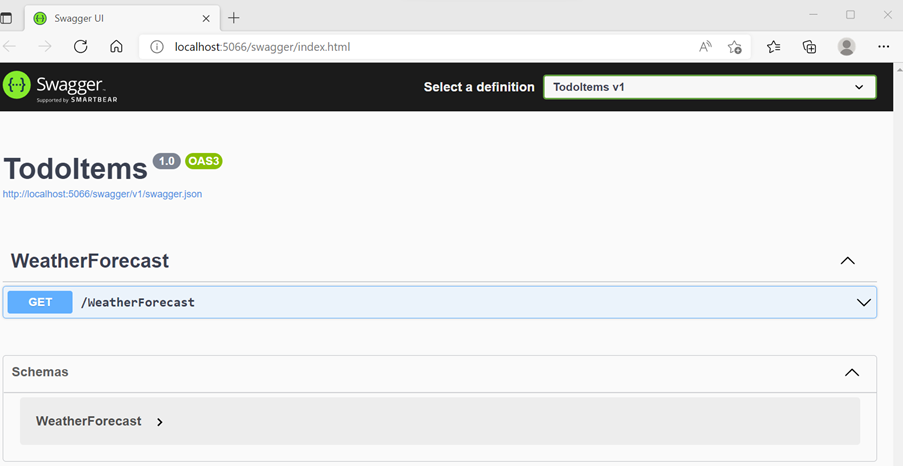

# C# MicroService REST API Tutorial

## Creating Web API
A Web API is an **application programming interface** for the Web. A Browser API can extend the functionality of a web browser. A Server API can extend the functionality of a web server.

## Overview
This module concerns creating a simple RESTful API using ASP.NET with the C# programming language. This tutorial creates the following API.

| REST Method | API        | Description            | Request Body | Response Body      |
|-------------|------------|------------------------|--------------|--------------------|
| GET         | /todo/     | Get all todo items     | None         | Array of todo item |
| GET         | /todo/{id} | Get an item by ID      | None         | todo item          |
| POST        | /todo/     | Add a new todo item    | todo item    | todo item          |
| PUT         | /todo/{id} | Update an existem item | todo item    | todo item          |
| DELETE      | /todo/{id} | Get all todo items     | None         | None               |

## Tutorial

### Creating a RESTful API with C# & ASP.NET Core
For this tutorial, we will be making use of Visual Studio 2022 and NuGet commands on the command-line to create a RESTful API abiding by the Repository, Strategy, and Dependency Injection patterns. Dependency injection helps achieve Inversion of Control (IoC).

The control flow between the APIs components will look like:

>```
>            ---------->         ---------->
>Controller              Service             Repository
>            <----------         <----------
>```
### Setup a new project in Visual Studio
1)	Open Visual Studio (Vs 2022) and Click Create a new project
2)	Under Languages, select C#
3)	In the search bar, type Web Api and Select ASP.NET Core Web Api


4)	Click Next
5)	Type the details of your project
a.	Project name = TodoItems
b.	Location = *you should use the folder location of your GITHUB repo created in the previous GIT Module with the following path 05-programming/tutorial*
c.	Leave the remaining field as below


6)	Click Next
7)	In the **Additional information** dialog:
a.	Confirm the **Framework** is **.NET 6.0 (Long-term support).**
b.	Deselect Configure for https (If you leave this selected, it will work but we don’t really need to concern ourselves with this in this tutorial)
c.	Confirm the checkbox for **Use controllers(uncheck to use minimal APIs)** is checked.
d.	Select **Create**.


8)	If all was done as above, you should have the below code structure



### Entity Framework
Entity Framework helps create an Object Mapping for communicating with the database and it also helps with using LinQ. Let us set this up.
1)	Click Tools -> NuGet Package Manager -> Package Manager Console
2)	Type the below commands:
>```
>Install-Package Microsoft.EntityFrameworkCore
>Install-Package Microsoft.EntityFrameworkCore.Tools
>Install-Package Microsoft.EntityFrameworkCore.SqlServer
>```

### Verify SetUp
Click **Debug -> Start Debugging** to test your application and you should be able to see similar view as the one below.



The Swagger page */swagger/index.html* is displayed. Select **GET > Try it out > Execute**. The page displays:

- The Curl command to test the WeatherForecast API.
- The URL to test the WeatherForecast API.
- The response code, body, and headers.
- A drop-down list box with media types and the example value and schema.

Swagger is a tool/library used to generate useful documentation and help pages for web APIs.

### Setup a model, database context and database service
1) Create a directory called Models, a directory called Services, a directory called Data and a directory called Repositories inside of the Data directory.

> -| Controllers
-| Services
-| Models
-| Data
---| Repositories
-| Properties
-| appsettings.json
-| MyProject.csproj
-| Program.cs
-| Startup.cs

2)	Create a new class inside Models called TodoItem.cs, place the following code inside:
>```
>public class TodoItem
>    {
>        [Key]
>        public int Id { get; set; }
>
>        [Required(ErrorMessage = "Description is required")]
>        [MaxLength(64, ErrorMessage = "Length of description cannot be greater than 64 characters")]
>        [MinLength(2, ErrorMessage = "Length of description cannot be less than 2 characters")]
>        public string? Description { get; set; }
>
>        [Required(ErrorMessage = "Status is required")]
>        public string? Status { get; set; }
>    }
>```

The data annotations used allow the specification of validation attributes for our business model, these can be validated in our controller.
Data annotations come from using

> ```System.ComponentModel.DataAnnotations;```
3)	Create a database context class for the **TodoItem** model called **TodoContext.cs** inside the **Data** directory

>```
>public class TodoContext : DbContext
>    {
>        public TodoContext(DbContextOptions<TodoContext> options) : base(options)
>        {
>        }
>        public DbSet<TodoItem> TodoItems { get; set; }
>    }
```