# C# MicroService REST API Tutorial

---

## Content

- [C# MicroService REST API Tutorial](#c-microservice-rest-api-tutorial)
  - [Content](#content)
  - [Creating Web API](#creating-web-api)
  - [Overview](#overview)
  - [Tutorial](#tutorial)
    - [Creating a RESTful API with C# & ASP.NET Core](#creating-a-restful-api-with-c--aspnet-core)
    - [Setup a new project in Visual Studio](#setup-a-new-project-in-visual-studio)
    - [Entity Framework](#entity-framework)
    - [Verify SetUp](#verify-setup)
    - [Setup a model, database context and database service](#setup-a-model-database-context-and-database-service)
    - [Create a controller to integrate with the service](#create-a-controller-to-integrate-with-the-service)
    - [Configure the created components and setup the database](#configure-the-created-components-and-setup-the-database)
    - [Run the application](#run-the-application)
    - [Update the launchUrl to remove Swagger (Optional)](#update-the-launchurl-to-remove-swagger-optional)
  - [Testing the APIs on Postman](#testing-the-apis-on-postman)
    - [Exercise (optional)](#exercise-optional)
      - [Clue to solving exercise](#clue-to-solving-exercise)
  - [Testing Code With Html Page](#testing-code-with-html-page)
    - [What is Cross Origin?](#what-is-cross-origin)
    - [What is Same origin?](#what-is-same-origin)
      - [So why do we have an issue with Origin?](#so-why-do-we-have-an-issue-with-origin)
      - [How do we fix this issue and test with our html page?](#how-do-we-fix-this-issue-and-test-with-our-html-page)
      - [COR Summary](#cor-summary)
  - [Publish onthe CLI](#publish-onthe-cli)
    - [Check the location of the file and you should see an exe file like below](#check-the-location-of-the-file-and-you-should-see-an-exe-file-like-below)

---

## Creating Web API
A Web API is an **application programming interface** for the Web. A Browser API can extend the functionality of a web browser. A Server API can extend the functionality of a web server.

## Overview
This module concerns creating a simple RESTful API using ASP.NET with the C# programming language. This tutorial creates the following API.

| REST Method | API        | Description            | Request Body | Response Body      |
|-------------|------------|------------------------|--------------|--------------------|
| GET         | /todo/     | Get all todo items     | None         | Array of todo item |
| GET         | /todo/{id} | Get an item by ID      | None         | todo item          |
| POST        | /todo/     | Add a new todo item    | todo item    | todo item          |
| PUT         | /todo/{id} | Update an existem item | todo item    | todo item          |
| DELETE      | /todo/{id} | Get all todo items     | None         | None               |

## Tutorial

### Creating a RESTful API with C# & ASP.NET Core
For this tutorial, we will be making use of Visual Studio 2022 and NuGet commands on the command-line to create a RESTful API abiding by the Repository, Strategy, and Dependency Injection patterns. Dependency injection helps achieve Inversion of Control (IoC).

The control flow between the APIs components will look like:

```
            ---------->         ---------->
Controller              Service             Repository
            <----------         <----------
```
### Setup a new project in Visual Studio
1)	Open Visual Studio (Vs 2022) and Click Create a new project
2)	Under Languages, select C#
3)	In the search bar, type Web Api and Select ASP.NET Core Web Api

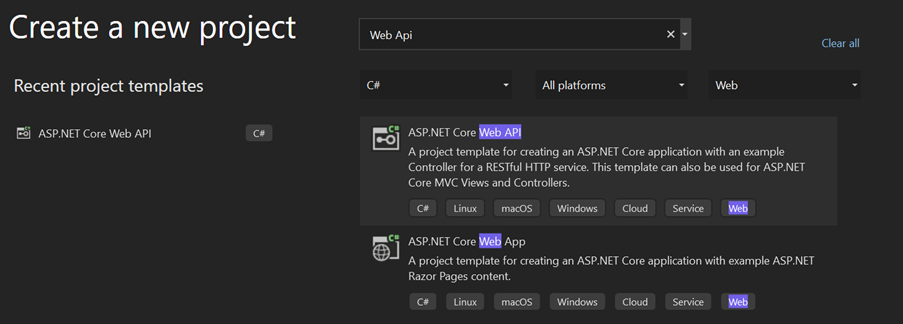

4)	Click Next
5)	Type the details of your project
a.	Project name = TodoItems
b.	Location = *you should use the folder location of your GITHUB repo created in the previous GIT Module with the following path 05-programming/tutorial*
c.	Leave the remaining field as below

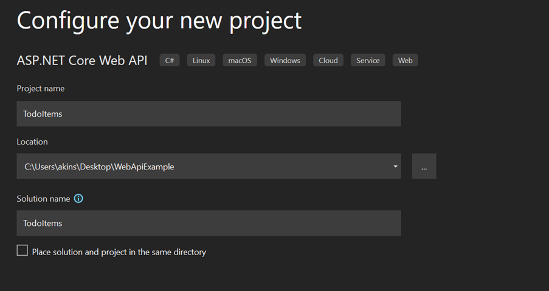

6)	Click Next
7)	In the **Additional information** dialog:
a.	Confirm the **Framework** is **.NET 6.0 (Long-term support).**
b.	Deselect Configure for https (If you leave this selected, it will work but we don’t really need to concern ourselves with this in this tutorial)
c.	Confirm the checkbox for **Use controllers(uncheck to use minimal APIs)** is checked.
d.	Select **Create**.

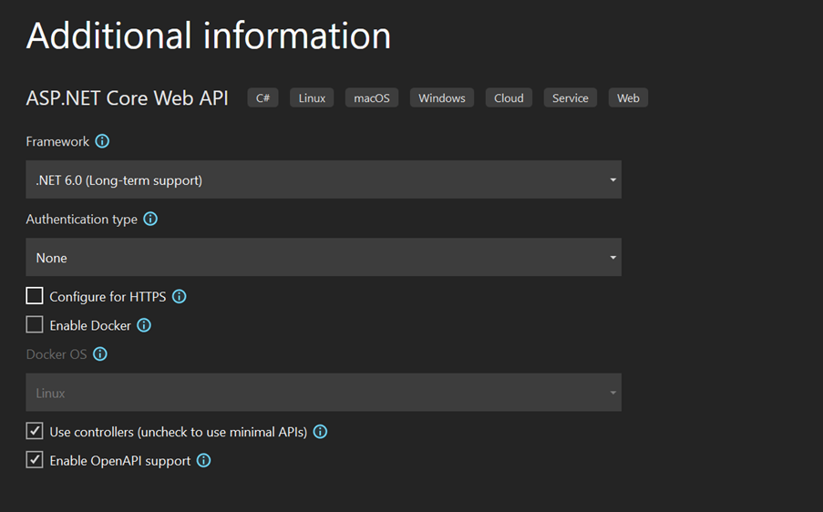

8)	If all was done as above, you should have the below code structure

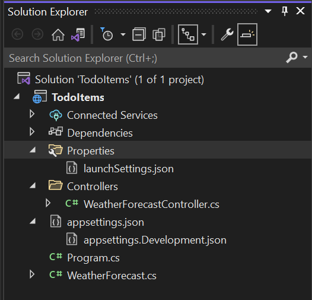

### Entity Framework
Entity Framework helps create an Object Mapping for communicating with the database and it also helps with using LinQ. Let us set this up.
1)	Click Tools -> NuGet Package Manager -> Package Manager Console
2)	Type the below commands:
>```
>Install-Package Microsoft.EntityFrameworkCore
>Install-Package Microsoft.EntityFrameworkCore.Tools
>Install-Package Microsoft.EntityFrameworkCore.SqlServer
>```

### Verify SetUp
Click **Debug -> Start Debugging** to test your application and you should be able to see similar view as the one below.

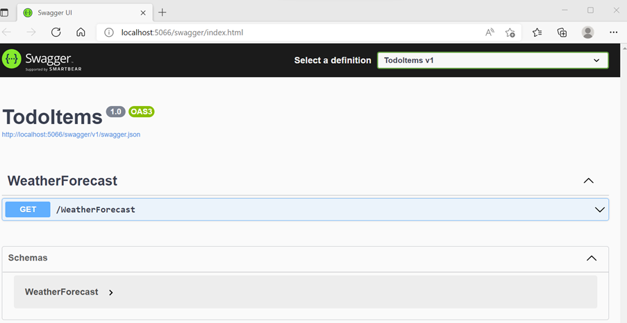

The Swagger page */swagger/index.html* is displayed. Select **GET > Try it out > Execute**. The page displays:

- The Curl command to test the WeatherForecast API.
- The URL to test the WeatherForecast API.
- The response code, body, and headers.
- A drop-down list box with media types and the example value and schema.

>Swagger is a tool/library used to generate useful documentation and help pages for web APIs.

### Setup a model, database context and database service
1) Create a directory called Models, a directory called Services, a directory called Data and a directory called Repositories inside of the Data directory.

```
-| Controllers
-| Services
-| Models
-| Data
---| Repositories
-| Properties
-| appsettings.json
-| MyProject.csproj
-| Program.cs
-| Startup.cs
```

2)	Create a new class inside Models called TodoItem.cs, place the following code inside:
```
public class TodoItem
    {
        [Key]
        public int Id { get; set; }

        [Required(ErrorMessage = "Description is required")]
        [MaxLength(64, ErrorMessage = "Length of description cannot be greater than 64 characters")]
        [MinLength(2, ErrorMessage = "Length of description cannot be less than 2 characters")]
        public string? Description { get; set; }

        [Required(ErrorMessage = "Status is required")]
        public string? Status { get; set; }
    }
```

The data annotations used allow the specification of validation attributes for our business model, these can be validated in our controller.
Data annotations come from using

> ```System.ComponentModel.DataAnnotations;```
3)	Create a database context class for the **```TodoItem```** model called **```TodoContext.cs```** inside the **```Data```** directory

```
public class TodoContext : DbContext
    {
        public TodoContext(DbContextOptions<TodoContext> options) : base(options)
        {
        }
        public DbSet<TodoItem> TodoItems { get; set; }
    }
```

>**Don't forget to import the Entity Framework** (```using Microsoft.EntityFrameworkCore;```)

4. Inside the **Data/Repositories** directory, create a CRUD enabled interface

```
public interface ICrudRepository<T, U>
    	{
        // CRUD
        public IEnumerable<T> GetAll();
        public T Get(U id);
        public void Add(T element);
        public void Update(T element);
        public void Delete(U id);

        // Extra
        public bool Exists(U id);
        public bool Save();
    	}
```

Create an implementation for the ICrudRepository interface inside the Data/Repositories directory and call it TodoRepository
```
public class TodoRepository : ICrudRepository<TodoItem, int>
    	{
        private readonly TodoContext _todoContext;
        public TodoRepository(TodoContext todoContext)
        {
            _todoContext = todoContext ?? throw new
            ArgumentNullException(nameof(todoContext));
        }
        public void Add(TodoItem element)
        {
            _todoContext.TodoItems.Add(element);
        }
        public void Delete(int id)
        {
            var item = Get(id);
            if (item is not null) _todoContext.TodoItems.Remove(Get(id));
        }
        public bool Exists(int id)
        {
            return _todoContext.TodoItems.Any(u => u.Id == id);
        }
        public TodoItem Get(int id)
        {
            return _todoContext.TodoItems.FirstOrDefault(u => u.Id == id);
        }
        public IEnumerable<TodoItem> GetAll()
        {
            return _todoContext.TodoItems.ToList();
        }
        public bool Save()
        {
            return _todoContext.SaveChanges() > 0;
        }
        public void Update(TodoItem element)
        {
            _todoContext.Update(element);
        }
    	}
```

6. Create an interface for CRUD enabled services in the Services directory
```
public interface ICrudService<T, U>
    	{
        // CRUD
        public IEnumerable<T> GetAll();
        public T Get(U id);
        public void Add(T element);
        public void Update(T oldElement, T newElement);
        public void Delete(U id);
    	}
```
7. Create an implementation of the CRUD service interface for the TodoItem model inside the Services directory
```
public class TodoService : ICrudService<TodoItem, int>
    	{
        private readonly ICrudRepository<TodoItem, int> _todoRepository;
        public TodoService(ICrudRepository<TodoItem, int> todoRepository)
        {
            _todoRepository = todoRepository;
        }
        public void Add(TodoItem element)
        {
            _todoRepository.Add(element);
            _todoRepository.Save();
        }
        public void Delete(int id)
        {
            _todoRepository.Delete(id);
            _todoRepository.Save();
        }
        public TodoItem Get(int id)
        {
            return _todoRepository.Get(id);
        }
        public IEnumerable<TodoItem> GetAll()
        {
            return _todoRepository.GetAll();
        }
        public void Update(TodoItem old, TodoItem newT)
        {
            old.Description = newT.Description;
            old.Status = newT.Status;
            _todoRepository.Update(old);
            _todoRepository.Save();
        }
    	}
```
>**Don't forget** to import your Data and Models folders

### Create a controller to integrate with the service

1. Inside your ```Controllers``` directory, create a class called ```TodoController.cs``` by Right clicking the Controller folder -> ```Add``` -> ```Controller``` -> ```Select MVC Controller Empty``` -> ```Click Add``` -> ```Change Name to TodoController``` -> ``Click Add
   
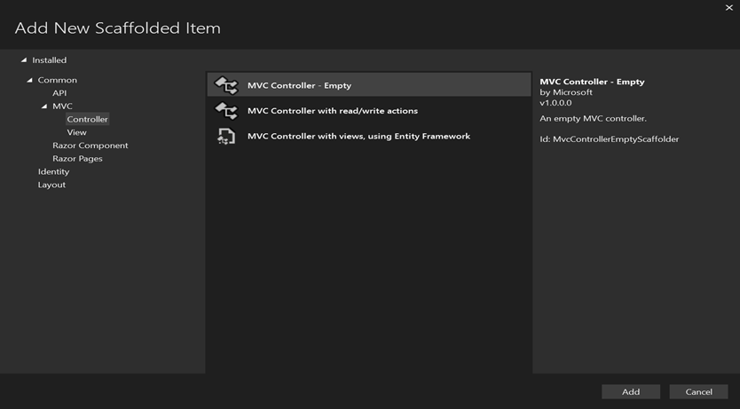
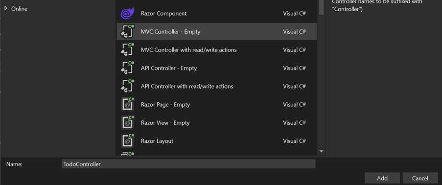

2. Replace the following code inside this file:
```
[ApiController]
    	[Route("[controller]")]//URL: http://localhost:5066/todo
    	public class TodoController : ControllerBase
    	{
        private readonly ICrudService<TodoItem, int> _todoService;
        public TodoController(ICrudService<TodoItem, int> todoService)
        {
            _todoService = todoService;
        }

        // GET all action
        [HttpGet] // auto returns data with a Content-Type of application/json
        public ActionResult<List<TodoItem>> GetAll() => _todoService.GetAll().ToList();
        
        // GET by Id action
        [HttpGet("{id}")]
        public ActionResult<TodoItem> Get(int id)
        {
            var todo = _todoService.Get(id);
            if (todo is null) return NotFound();
            else return todo;
        }

        // POST action
        [HttpPost]
        public IActionResult Create(TodoItem todo)
        {
            // Runs validation against model using data validation attributes
            if (ModelState.IsValid)
            {
                _todoService.Add(todo);
                return CreatedAtAction(nameof(Create), new { id = todo.Id }, todo);
            }
            return BadRequest();
        }

        // PUT action
        [HttpPut("{id}")]
        public IActionResult Update(int id, TodoItem todo)
        {
            var existingTodoItem = _todoService.Get(id);
            if (existingTodoItem is null || existingTodoItem.Id != id)
            {
                return BadRequest();
            }
            if (ModelState.IsValid)
            {
                _todoService.Update(existingTodoItem, todo);
                return NoContent();
            }
            return BadRequest();
        }

        // DELETE action
        [HttpDelete("{id}")]
        public IActionResult Delete(int id)
        {
            var todo = _todoService.Get(id);
            if (todo is null) return NotFound();
            _todoService.Delete(id);
            return NoContent();
        }
    	}
```        
Attributes for HTTP are coming from **'''using Microsoft.AspNetCore.Mvc'''**;

### Configure the created components and setup the database

1. Add a connection string to **'''appsettings.json'''**
```
{
  "ConnectionStrings": {
    "DefaultConnection": "Server=(localdb)\\mssqllocaldb;Database=TodoDatabase;Trusted_Connection=True;MultipleActiveResultSets=true"
  },
  "Logging": {
    "LogLevel": {
      "Default": "Information",
      "Microsoft.AspNetCore": "Warning"
    }
  },
  "AllowedHosts": "*"
}
```

This is connecting to a Microsoft SQL Server Local Database which stores files in **```C:\Users\<user>\AppData\Local\Microsoft\Microsoft SQL Server Local DB\Instances\mssqllocaldb```**. You can change the connection string to your locally installed SQL Server Express database if you prefer to do this.

2. Configure services in **```Program.cs```** for dependency injection
- Add the **```TodoContext```** database context
- Add the **```TodoRepository```** implementation
- Add the **```TodoService```** implementation

Replace Program.cs with the below code
```
using Microsoft.EntityFrameworkCore;
using Microsoft.OpenApi.Models;
using TodoItems.Data;
using TodoItems.Data.Repositories;
using TodoItems.Models;
using TodoItems.Services;

var builder = WebApplication.CreateBuilder(args);

// Add services to the container.
builder.Services.AddDbContext<TodoContext>(options =>
options.UseSqlServer(builder.Configuration.GetConnectionString("DefaultConnection")));
builder.Services.AddScoped<ICrudRepository<TodoItem, int>, TodoRepository>();
builder.Services.AddScoped<ICrudService<TodoItem, int>, TodoService>();
builder.Services.AddControllers();

builder.Services.AddEndpointsApiExplorer();

// Learn more about configuring Swagger/OpenAPI at https://aka.ms/aspnetcore/swashbuckle
builder.Services.AddSwaggerGen(c =>
{
    c.SwaggerDoc("v1", new OpenApiInfo
    {
        Title = "TodoRestAPI",
        Version =
    "v1"
    });
});

var app = builder.Build();

// Configure the HTTP request pipeline.
if (app.Environment.IsDevelopment())
{
    app.UseSwagger();
    app.UseSwaggerUI();
}

app.UseAuthorization();

app.MapControllers();

app.Run();
```

3. Migrate the database
In the NuGet Package Manager console, run the following commands to setup the database tables based on the supplied database context:

```
Add-Migration [migration_name]
Update-Database
```

- Replace **[migration_name]** with the desired name for the migration
- Migrations are stored inside a **Migrations** directory in your project, these programmatically display what actions are being took against the database

### Run the application
Run the application and Swagger should display the rest api for you to test

### Update the launchUrl to remove Swagger (Optional)
Once you are sure everything is working fine, you can remove Swagger and just trigger with the end points

In **```Properties\launchSettings.json```**, update **```launchUrl```** from "```swagger```" to "```todo```":

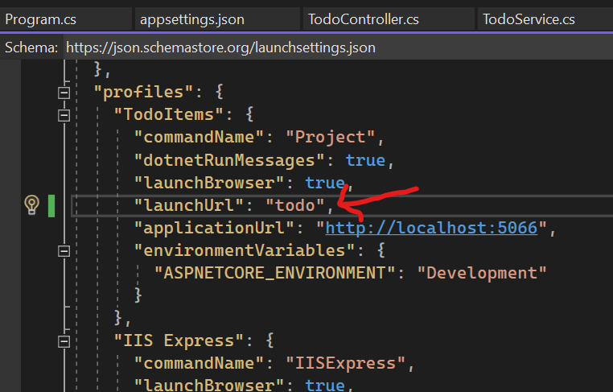

Because Swagger will be removed, the preceding markup changes the URL that is launched to the GET method of the controller added in the following sections.

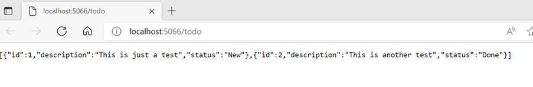

## Testing the APIs on Postman
In order for us to better test the APIs and simulate a real client, we can use a tool like postman to help us verify that each RESTful method is working properly. So again, make sure you downloaded and installed Postman on your machine.

Of course, you can always test through Swagger UI that was shown previously, however I prefer Postman since it has a comprehensive and advanced testing and simulation for client’s communication with the APIs.

So, let’s open postman and start our simulation.

Let’s first create a postman collection so that we save our API requests. This can come very handy whenever you are doing regular changes on your APIs making it easy to verify your work.
In the left menu, click Create a Collection, give it a name ‘TodoApi’ and you should see this.

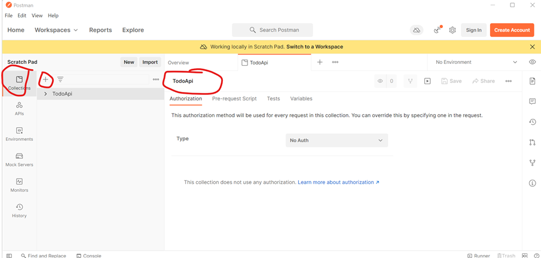

Now click Add requests (you can click the 3 ellipses dot), our request will be a Get operation to view the todo Items.

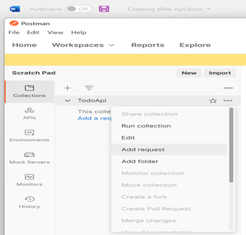

Let’s name it Get TodoItems, type the URL ```http://localhost:5066/todo``` -> then click save -> Click Send to get the response.

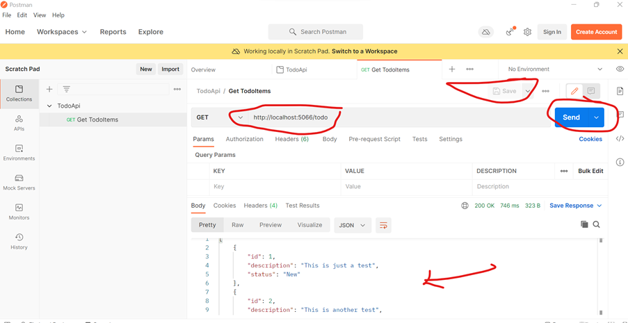

Nice if you getting this. You might get the below error if you using https, this is because postman needs to verify the https certificate and since it is installed on your local machine, it cannot find a matching certificate there, so the easy way here to test it is to Disable SSL Verification in postman.

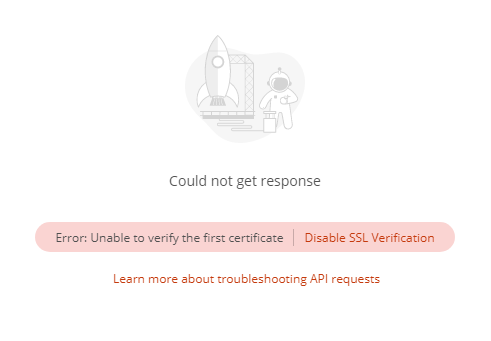

Now, once you disabled the SSL verification, postman will re-send your request, and now you should get a 200 ok response with all the movies in json format.

### Exercise (optional)
Can you configure postman to perform GET 1 Item, PUT, DELETE, and POST actions?

#### Clue to solving exercise ####

*Get 1 item using the Id*
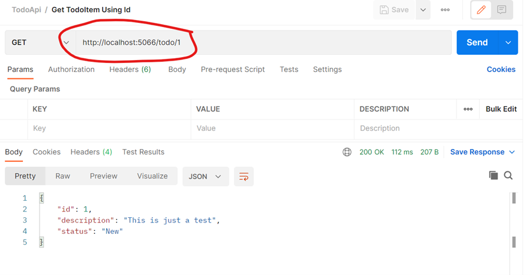

*Create TodoItem (Post)*
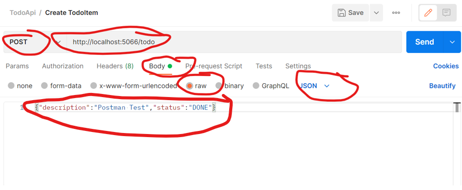

*Update TodoItem (Post)*
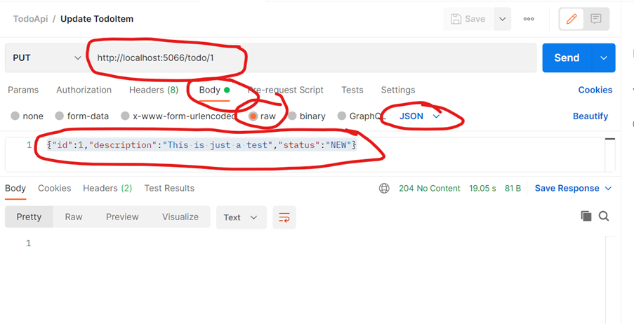

## Testing Code With Html Page
I have provided an html page that allows the client to View, Add, and Update an Item by calling our service api. I will not bore you with the html code but to summarise, the html does it call using AJAX to fetch the result from the api and all you need to do is to run your web api project before running the html script.

Below is a sample of how the html page will look when you run it.

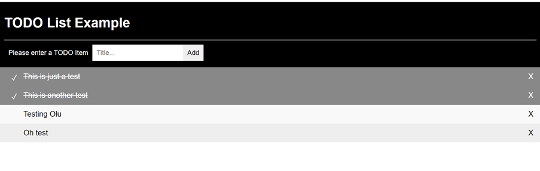

To make this html page work, we need to enable cross origin policy in our Asp.net Web Api project (TodoItems) but first, let’s try and understand what EnableCors mean.

What is Cross Origin?
First, let me point this out: Cross origin is a browser behaviour and not Asp.net rule hence why we have to adhere to this rule. So what is it? Browser security prevents a web page from making requests to a different domain than the one that served the web page. This restriction is called the same-origin policy. The same-origin policy prevents a malicious site from reading sensitive data from another site. Sometimes, you might want to allow other sites to make cross-origin requests to your app. 

### What is Cross Origin?
First, let me point this out: Cross origin is a browser behaviour and not Asp.net rule hence why we have to adhere to this rule. So what is it? Browser security prevents a web page from making requests to a different domain than the one that served the web page. This restriction is called the same-origin policy. The same-origin policy prevents a malicious site from reading sensitive data from another site. Sometimes, you might want to allow other sites to make cross-origin requests to your app. 

### What is Same origin?
Two URLs have the same origin if they have identical schemes, hosts, and ports.

These two URLs have the same origin:
- https://example.com/foo.html
- https://example.com/bar.html

These URLs have different origins than the previous two URLs:
- https://example.net: Different domain
- https://www.example.com/foo.html: Different subdomain
- http://example.com/foo.html: Different scheme
- https://example.com:9000/foo.html: Different port

#### So why do we have an issue with Origin?
In our case, we have an html page running on our computer (Remember our computer have a different domain on the internet, probably by IP address 192.168.1. 178) but as you will see VS 2022 comes with an in-built ASP.NET web Server which runs our todo result via ```http://localhost:5066/todo```. This means our domain for our Web API project is localhost:5066 but the domain for the html page is different because our computer (which is the client) have a different domain name.

#### How do we fix this issue and test with our html page?
We need to go back into our Web Api Project and write the below CORS command to enable Cors so that our html page will work.

Replace the code in Program.cs with the below code. I have highlighted the main changes below.
```
using Microsoft.EntityFrameworkCore;
using Microsoft.OpenApi.Models;
using TodoItems.Data;
using TodoItems.Data.Repositories;
using TodoItems.Models;
using TodoItems.Services;

var MyAllowSpecificOrigins = "_myAllowSpecificOrigins";
var builder = WebApplication.CreateBuilder(args);

// Add services to the container.
builder.Services.AddDbContext<TodoContext>(options =>
options.UseSqlServer(builder.Configuration.GetConnectionString("DefaultConnection")));
builder.Services.AddScoped<ICrudRepository<TodoItem, int>, TodoRepository>();
builder.Services.AddScoped<ICrudService<TodoItem, int>, TodoService>();

builder.Services.AddCors(options =>
{
    options.AddPolicy(name: MyAllowSpecificOrigins,
        policy =>
        {
            policy.AllowAnyOrigin()
            .AllowAnyHeader()
            .AllowAnyMethod();
        });
});

builder.Services.AddControllers();

builder.Services.AddEndpointsApiExplorer();

// Learn more about configuring Swagger/OpenAPI at https://aka.ms/aspnetcore/swashbuckle
builder.Services.AddSwaggerGen(c =>
{
    c.SwaggerDoc("v1", new OpenApiInfo
    {
        Title = "TodoRestAPI",
        Version =
    "v1"
    });
});

var app = builder.Build();

app.UseCors(MyAllowSpecificOrigins);//To EnableCors - CrossOrigin

// Configure the HTTP request pipeline.
if (app.Environment.IsDevelopment())
{
    app.UseSwagger();
    app.UseSwaggerUI();
}

app.UseAuthorization();

app.MapControllers();

app.Run();
```

#### COR Summary
- Is a W3C standard that allows a server to relax the same-origin policy.
- Is not a security feature, CORS relaxes security. An API is not safer by allowing CORS. For more information, see How CORS works.
- Allows a server to explicitly allow some cross-origin requests while rejecting others.
- Is safer and more flexible than earlier techniques, such as JSONP.

## Publish onthe CLI
To publish, open the command line of your project and type dotnet ```publish -c Release```. This creates the executables that you can push to your desired location

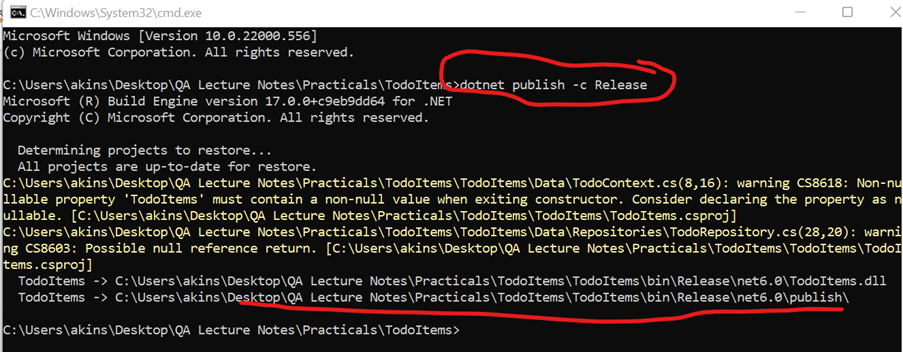

### Check the location of the file and you should see an exe file like below

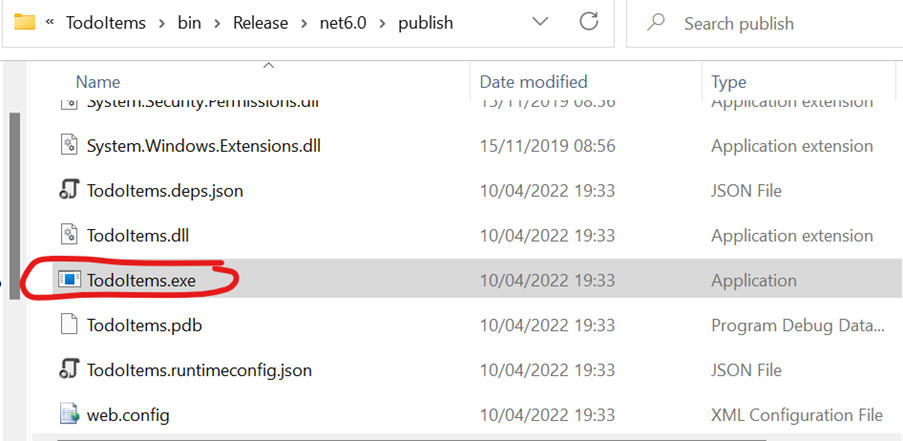

Launch the TodoItems.exe by double clicking on the file to run it and you see below:

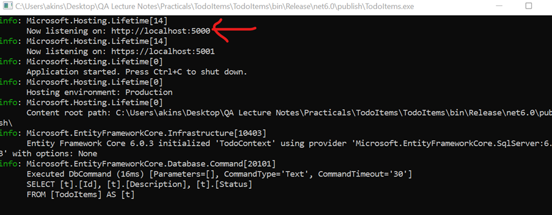

The image shows that it is listening to localhost:5000. Open the html script “Todo.html” and replace the localhost port.

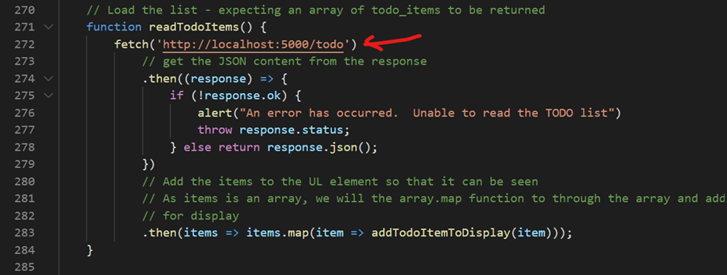

After the changes, you can now run your html script on a browser and you will see the same result as when running the WEB API on visual studio.

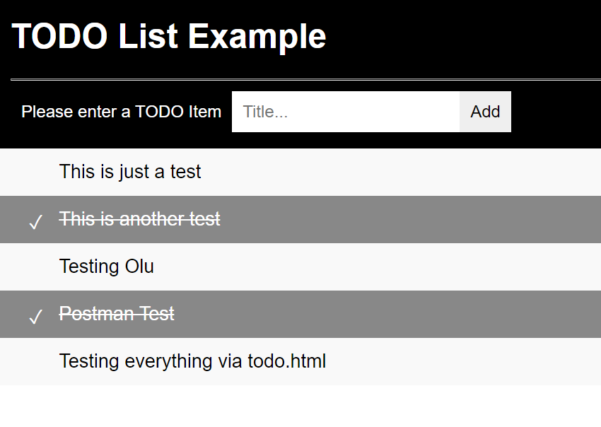