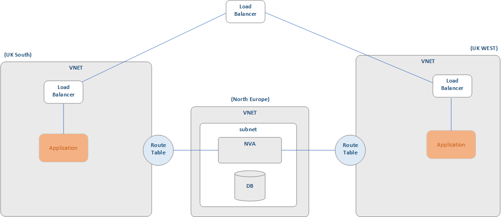

# AVANADE CHALLENGE LAB

## INTRODUCTION

The purpose of this document is to outline the final challenge project to consolidate learning for Velocity 1b 2022 program.  This final challenge lab project is an opportunity for you to consolidate their knowledge and skills and demonstrate application of learning from the whole programme. 
In the first challenge lab you created a WEB application and C# micro-service. This final challenge lab builds on that solution and expects you to apply the knowledge and skills from the second part of the programme in creating a final solution. 
In this exercise you need to augment the first project with the Azure Infrastructure and other knowledge gained in the second half of the program. Specifically, this will involve:

- Agile
- GIT Source Code management and version control
- Programming and WEB Development (C#, HTML & JavaScript)
- Database and SQL
- Deploying applications via Azure Pipeline
- Automation: Infrastructure As Code (Terraform), Configuration As Code (Ansible)
- Operating Systems: Linux and Windows
- Cloud Infrastructure and Network

This challenge lab is purposefully open to allow for demonstration of creativity in an unfamiliar context.  High level designs for the application and infrastructure are provided for reference.  You may tweak this project to your own design if it fulfils the project scope.  You have four days to deliver the project and should demonstrate how you have organised your time to deliver the greatest value.

## OBJECTIVE

To demonstrate the knowledge and skills acquired through the programme, your overall objective with this project is to:

- create an infrastructure based on a Hub and Spoke design, as covered in the Cloud Fundamentals & Azure Admin module, that provides load balancing your WEB application built in the previous lab
- create a CRUD application with the utilization of supporting tools, methodologies and technologies that encapsulate modules covered during training.  It is expected that you will re-use the WEB Application from the previous exercises but consider the knowledge and skills you have acquired since then and how you would now approach the problem and the changes that you would make.
- deploy a cloud database for the WEB application
- demonstrate an understanding of automation utilising Infrastructure as Code to create the infrastructure complete the application deployment.  It is expected that you will utilise and update the existing CI/CD pipeline and not recreate things you have already built and demonstrated knowledge of.

Specifically, you are required to:
- create an Azure infrastructure with the appropriate network, components, and configuration
- deploy the self-study application load balanced across two Azure Regions
- a relational database hosted within Azure examined during your Cloud Fundamentals module 

## SCOPE
The requirements of the project are as follows:

- An Azure Board with full expansion on user stories, use cases and tasks needed to complete the project.  It could also provide a record of any issues or risks that you faced creating your project. (Module Reference: Agile Teams and Practices, DevOps, Agile DevOps)

- An Azure Cloud Infrastructure that compiles to the Hub and Spoke pattern with Load Balancing capability to your application. (Module Reference: Cloud Fundamentals & Azure Admin module)

You are free to choose the type of Load Balancer and other network components but should be able to explain your reasons for doing so.

It is expected that you will use the automation skills learnt in the programme to achieve the creation of the infrastructure.  You can use portal as an alternative if required but this decision must be justified.

- A relational database used to store data persistently for the project, this database needs to have at least 2 tables and is deployed with Azure.  This database needs to be accessible by your load balanced application.

- Your application should be load balanced over two separate VNETs and accessible (Module Reference: Cloud Fundamentals & Azure Admin module)
 
- You should consider automation first for your application deployment (Module Reference: IAC Terraform, Pipeline)

- Clear Documentation from a design phase describing the architecture you will use for your project, justification for any significant decisions and a detailed Risk Assessment. (Module Reference: GIT)

- Set out what you consider to be the next stages of development for the solution recognising that at this point you will have only developed an MVP.  Your answer should cover both any change in practices (e.g. level of automation) and technologies that would be deployed.

## CONSTRAINTS

- Azure Board
- Cloud Infrastructure: Azure
- Automation: Terraform, Ansible
- Database – Any 
- Programming languages: C#
- Unit Testing with C#
- Front-end: HTML and JavaScript
- Version Control: Git
- CI Server: Azure DevOps

## DELIVERABLE
The Minimum Viable Product for this project is an accessible application deployed in a Hub and Spoked topology load balanced across two Azure regions.  You should also provide documentation of your design stored with your code in the source repository. 