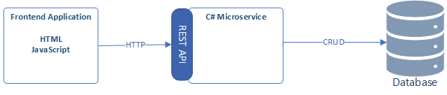
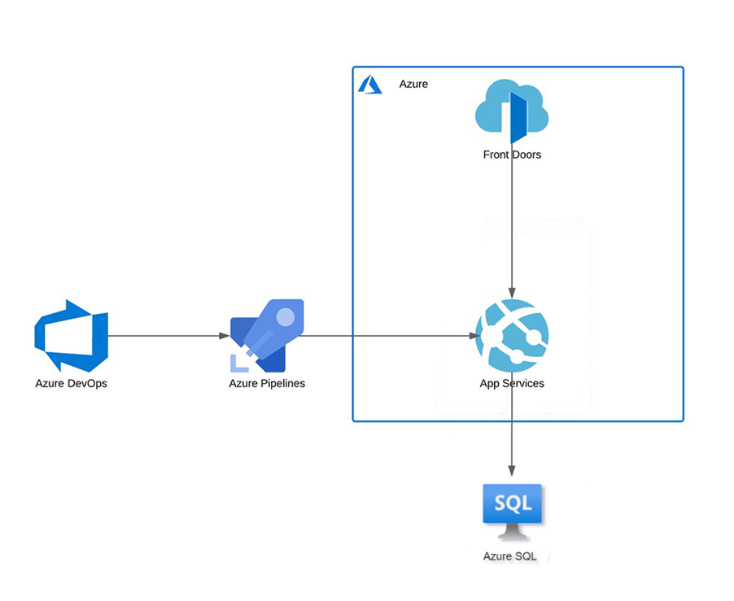

# AVANADE SELF STUDY PROJECT

## INTRODUCTION

The purpose of this project to consolidate delegates learning from modules given to this stage.  Specifically:

 - Agile 
 - C# 
 - Databases 
 - Javascipt & html 
 - Azure pipeline 
 - Azure networking 
 
 This project has been designed to support creativity and allow you to demonstrate your understanding of the technical topics covered in an area that you are passionate about.  there are a number of requirements that you must meet but the context in which you do this is open. 
 
## OBJECTIVE

Your overall objective with this project is the following: 

- To create a crud application with the utilisation of supporting tools, methodologies and technologies that encapsulate the knowledge and skills covered during training.

The following shows the basic application archtecture that you are expected to create.

### Suggested Applications: 

The application that you create should have a minimum of three user journeys:

1)	To populate a database table with a number of resources (this could be rooms, people, sessions at an event)
2)	For a user to make a booking or request for one of those resources 
3)	For a supplier to confirm a booking

The following shows some suggested applications but delegates are free to chose their own.

-	A todo application that allows adding, deleting, update and search TODO items
-	A library application that allows adding, deleting, update and search book items

You have a limited amount of time available to complete this project and so please do not spend too long thinking of an example scenario but focus on how you will demonstrate understanding of the topics covered so far.

## Scope

The requirements set for the project are below.  Note that these are a minimum set of requirements that you can add to during the project. The following diagram shows the suggested infrasture architecture:

The requirements of the project are as follows:
- Azure board with full expansion on user stories, use cases and tasks needed to complete the project. it could also provide a record of any issues or risks that you faced creating your project. 
- A relational database used to store data persistently for the the project, this database needs to have at least 2 tables in it, to demonstrate your understanding.
- Clear documentation from a design phase describing the architecture you will use for your project as well as a detailed risk assessment.
- A functional CRUD application created in c#, following best practices and design principles, that meets the requirements set on your board
- Fully designed test suites for the application you are creating, - a functioning front-end website and integrated with rest api to your application 
- Code fully integrated into a version control system using the feature-branch model which will subsequently be built through a ci server and deployed to a cloud-based virtual machine.

You should consider the concept of MVP (minimum viable product) as you plan your project, completing all the requirements above before you add the extra functionality that is not specified above.

## Constraints

- Your application needs to be CRUD functional.
- When creating the entities for your project, you should create **at least 2 tables**
- The application you create as part of your training should be used as a reference architecture, not as the foundation for your project.
- The other constraint for this is certain technology that needs to be used. the application needs to utilise the technology discussed during the training modules. the tech stack required would be the following:

- Azure board 
- Database: Azure SQL
- Programming Languages: C# - unit testing with C#
- Front-End: HTML and JavaScript
- Version control: GIT
- CI server: Azure DevOps
  
## Deliverable

The final deliverable for this project is the completed application with full documentation around the utilisation of supporting tools. the documentation must be provided as a `readme.md` at the root of yourfolder structure. this will require a fully functional application based on the domain that you have chosen.